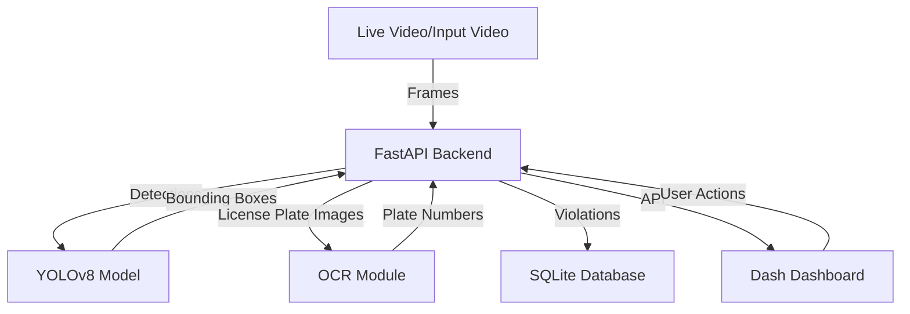

# Architecture Overview

## System Components

- **FastAPI Backend**: Handles API requests, video processing, vehicle detection, speed calculation, OCR, and database operations.
- **Dash Dashboard**: Provides a real-time, interactive UI for monitoring violations and analytics.
- **SQLite Database**: Stores violation records, vehicle data, and logs.
- **YOLOv8 Model**: Used for vehicle detection in video frames.
- **OCR Module**: Extracts license plate numbers from detected vehicles.

## Data Flow Diagram

## Sequence of Operations
1. Video is uploaded or streamed to the backend.
2. Backend processes frames, detects vehicles, and calculates speed.
3. License plates are extracted and recognized via OCR.
4. Violations are stored in the database.
5. Dashboard fetches and displays real-time analytics and violation records. 